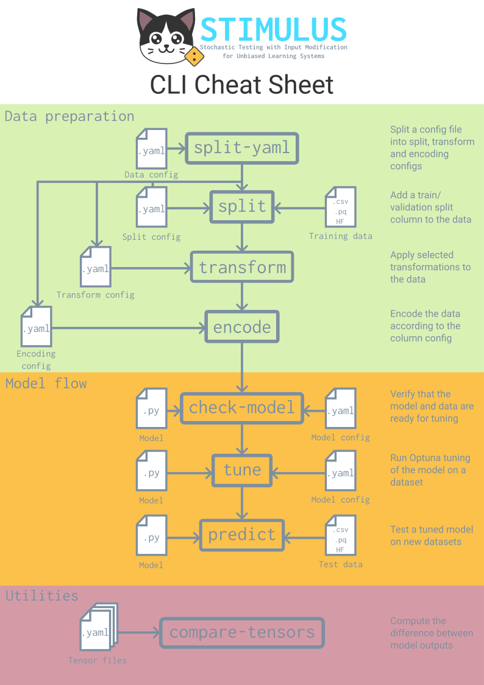

# STIMULUS 
## Stochastic Testing with Input Modification for Unbiased Learning Systems.

[](https://github.com/mathysgrapotte/stimulus-py/actions?query=workflow%3Aci)
[](https://mathysgrapotte.github.io/stimulus-py/)
[](https://nfcore.slack.com/channels/deepmodeloptim)

<!-- [](https://pypi.org/project/stimulus-py/) -->

> WARNING:
> This package is in active development and breaking changes may occur. The API is not yet stable and features might be added, modified, or removed without notice. Use in production environments is not recommended at this stage.
>
> We encourage you to:
>
> - 📝 Report bugs and issues on our [GitHub Issues](https://github.com/mathysgrapotte/stimulus-py/issues) page
>
> - 💡 Suggest features and improvements through [GitHub Discussions](https://github.com/mathysgrapotte/stimulus-py/discussions)
>
> - 🤝 Contribute by submitting pull requests
>
> We are actively working towards release 1.0.0 (see [milestone](https://github.com/mathysgrapotte/stimulus-py/milestone/1)), check the slack channel by clicking on the badge above where we are actively discussing. Build with us every wednesday at 14:00 CET until 18:00 CET on the nf-core gathertown (see slack for calendar updates i.e. some weeks open dev hours are not possible)

## Introduction

Idea is simple, better data equals better models. Refining raw bio-data is hard (it is an entire field called bioinformatics!) and optimised for humans. 

Stimulus provides an alternative, optimise bio-data for machines with both a **Python API** and a **CLI interface**.

## 🔧 Core Features

1. **Data Processing & Encoding**:  
   Handle various data types (text, numeric, categorical) with configurable encoders.

2. **Data Transformation & Augmentation**:  
   Define bio-data refining functions in pure python.

3. **Hyperparameter Optimization**:  
   Make sure models can be compared accross datasets using integrated hyperparameter tuning.

4. **Model Validation**:  
   Define your model in pure pytorch and automatically tune/train models on your augmented dataset.

5. **Performance Analysis**:  
   Compare model predictions and generate comprehensive reports

6. **CLI Workflow**:  
   Complete end-to-end ML workflow through command-line interface.

📹 Stimulus was featured at the nextflow summit 2024 in Barcelona, you can watch the talk [here](https://www.youtube.com/watch?v=dC5p_tXQpEs)

Stimulus truly shines when it can be ran at large scales, accross different datasets, transforms etc. If you need to run at scale, check our [nf-core](https://nf-co.re) [deepmodeloptim](https://github.com/nf-core/deepmodeloptim) pipeline. It leverages stimulus under the hood but uses configurations to run many experiments in parralel accross large compute environments.


## 🚀 Quick Start

### Installation

Clone the repository then run

```bash
uv make setup
```

if you do not have uv, install it manually:

```bash
curl -LsSf https://astral.sh/uv/install.sh | sh
```

### Python API Usage

```python
import stimulus
import datasets
from stimulus.api import create_encoders_from_config, create_splitter_from_config

# Load your dataset
dataset = datasets.load_dataset("csv", data_files="data.csv")

# Configure encoders
encoder_config = {
    "columns": [
        {
            "column_name": "age",
            "column_type": "input", 
            "encoder": [{"name": "NumericEncoder", "params": {"dtype": "float32"}}]
        },
        {
            "column_name": "survived",
            "column_type": "label",
            "encoder": [{"name": "NumericEncoder", "params": {"dtype": "int8"}}]
        }
    ]
}

# Create and apply encoders
encoders = create_encoders_from_config(encoder_config) # here you could instead define your own encoders in pure python!
encoded_dataset = stimulus.encode(dataset, encoders)

# Configure and apply data splitting
splitter_config = {
    "split": {
        "split_method": "RandomSplitter",
        "params": {"test_ratio": 0.2, "random_state": 42},
        "split_input_columns": ["age"],
    }
}
splitter, split_columns = create_splitter_from_config(splitter_config) # here you could instead define your own splitter in pure python!
split_dataset = stimulus.split(encoded_dataset, splitter, split_columns)

# Hyperparameter tuning
best_config, best_model, metrics = stimulus.tune(
    dataset=split_dataset,
    model_class=MyModel,
    model_config=model_config,
    n_trials=20,
)

# Make predictions
predictions = stimulus.predict(split_dataset, best_model)
```

## 🏗️ Model Requirements

Your PyTorch models must implement `train_batch()` and `inference()` methods for integration with Stimulus:

```python
import torch

class MyModel(torch.nn.Module):
    def __init__(self, hidden_size=128, num_layers=2):
        super().__init__()
        self.layers = torch.nn.Sequential(
            torch.nn.Linear(16, hidden_size),
            *[torch.nn.Linear(hidden_size, hidden_size) for _ in range(num_layers-1)],
            torch.nn.Linear(hidden_size, 1)
        )
    
    def forward(self, **inputs):
        # Handle named inputs from your dataset
        x = torch.stack([inputs[key] for key in sorted(inputs.keys())], dim=1)
        return self.layers(x)
    
    def train_batch(self, batch, optimizer, loss_fn):
        """Required method for training steps"""
        # Forward pass
        output = self.forward(**batch)
        
        # Compute loss
        loss = loss_fn(output, batch["target"])
        
        # Backward pass and optimization
        optimizer.zero_grad()
        loss.backward()
        optimizer.step()
        
        # Return loss and metrics
        accuracy = ((output > 0.5) == batch["target"]).float().mean()
        return loss, {"accuracy": accuracy, "predictions": output}
    
    def inference(self, batch, loss_fn):
        """Required method for inference steps"""
        # Forward pass only
        output = self.forward(**batch)
        
        # Compute loss for validation
        loss = loss_fn(output, batch["target"])
        
        # Return loss and metrics
        accuracy = ((output > 0.5) == batch["target"]).float().mean()
        return loss, {"accuracy": accuracy, "predictions": output}
```

### CLI Usage

Stimulus provides a comprehensive CLI interface accessible via the `stimulus` command:

> NOTE:
> This requires some configuration magic and the way we handle configs at the moment is very... unintuitive, so stay tuned (no pun intented) for future releases that will  make this easier.

```bash
# Check model configuration
stimulus check-model --model-file model.py --model-config config.yaml --data-config data.yaml

# Process and encode data
stimulus encode-csv --input data.csv --config data_config.yaml --output encoded_data.parquet

# Split datasets
stimulus split-csv --input data.csv --config split_config.yaml --output-dir splits/

# Transform data with augmentations
stimulus transform-csv --input data.csv --config transform_config.yaml --output transformed_data.parquet

# Run hyperparameter tuning
stimulus tune --model-file model.py --model-config model_config.yaml --data-config data_config.yaml --output-dir results/

# Make predictions
stimulus predict --model-file model.py --model-config best_config.json --weights model.safetensors --data test_data.parquet

# Compare prediction tensors
stimulus compare-tensors --input-dir predictions/ --mode cosine_similarity
```

You can use the diagram below for quick reference on the available commands and their inputs.



## 📋 Configuration Files

### Data Configuration

Define your data processing pipeline with YAML configuration:

```yaml
# data_config.yaml
global_params:
  seed: 42

columns:
  - column_name: "age"
    column_type: "input"
    encoder:
      - name: NumericEncoder
        params:
          dtype: "float32"
  
  - column_name: "survived"
    column_type: "label" 
    encoder:
      - name: NumericEncoder
        params:
          dtype: "int8"

transforms:
  - transformation_name: "noise"
    columns:
      - column_name: "age"
        transformations:
          - name: GaussianNoise
            params:
              std: [0.1, 0.2, 0.3]

split:
  - split_method: RandomSplit
    split_input_columns: ["age"]
    params:
      split: [0.7, 0.3]
```

### Model Configuration

Configure hyperparameter search spaces:

```yaml
# model_config.yaml
max_samples: 1024
compute_objective_every_n_samples: 64
n_trials: 10

network_params:
  hidden_size:
    mode: int
    params:
      low: 32
      high: 512
  num_layers:
    mode: int
    params:
      low: 1
      high: 4

optimizer_params:
  method:
    mode: categorical
    params:
      choices: ["Adam", "SGD"]
  lr:
    mode: float
    params:
      low: 0.0001
      high: 0.1
      log: true

loss_params:
  loss_fn:
    mode: categorical
    params:
      choices: ["CrossEntropyLoss", "MSELoss"]
```


## 🔧 Available CLI Commands

| Command | Description |
|---------|-------------|
| `stimulus check-model` | Check model configuration and run initial tests |
| `stimulus encode-csv` | Encode data according to configuration |
| `stimulus split-csv` | Split rows in CSV data files |
| `stimulus split-split` | Split YAML configuration into multiple files |
| `stimulus split-transforms` | Split transform configurations into multiple files |
| `stimulus transform-csv` | Transform data in CSV files |
| `stimulus tune` | Run hyperparameter tuning for models |
| `stimulus predict` | Use trained models for prediction |
| `stimulus compare-tensors` | Compare multiple tensor files |

## 📚 Complete Example

Here's a complete example using the Titanic dataset:

```python
import stimulus
import datasets
from stimulus.api import create_encoders_from_config, create_splitter_from_config

# Load Titanic dataset
dataset = datasets.load_dataset("csv", data_files="titanic.csv")

# Configuration for encoding
config = {
    "columns": [
        {"column_name": "Age", "column_type": "input", 
         "encoder": [{"name": "NumericEncoder", "params": {"dtype": "float32"}}]},
        {"column_name": "Sex", "column_type": "input",
         "encoder": [{"name": "StrClassificationEncoder", "params": {"dtype": "int8"}}]},
        {"column_name": "Pclass", "column_type": "input",
         "encoder": [{"name": "NumericEncoder", "params": {"dtype": "int8"}}]},
        {"column_name": "Survived", "column_type": "label",
         "encoder": [{"name": "NumericEncoder", "params": {"dtype": "int8"}}]},
    ]
}

# Process data
encoders = create_encoders_from_config(config)
encoded_dataset = stimulus.encode(dataset, encoders)

# Split data
splitter_config = {
    "split": {
        "split_method": "RandomSplitter", 
        "params": {"test_ratio": 0.2},
        "split_input_columns": ["Age"]
    }
}
splitter, split_columns = create_splitter_from_config(splitter_config)
split_dataset = stimulus.split(encoded_dataset, splitter, split_columns)

# Define model configuration
model_config = {
    "network_params": {
        "hidden_size": {"mode": "int", "params": {"low": 32, "high": 128}},
        "num_layers": {"mode": "int", "params": {"low": 1, "high": 3}}
    },
    "optimizer_params": {
        "method": {"mode": "categorical", "params": {"choices": ["Adam"]}},
        "lr": {"mode": "float", "params": {"low": 0.001, "high": 0.1, "log": True}}
    }
}

# Tune hyperparameters
best_config, best_model, metrics = stimulus.tune(
    dataset=split_dataset,
    model_class=TitanicModel,
    model_config=model_config,
    n_trials=10
)

print(f"Best accuracy: {metrics['val_accuracy']:.3f}")
```


## citations

[^1]: Godbole, V., Dahl, G. E., Gilmer, J., Shallue, C. J., & Nado, Z. (2023). Deep Learning Tuning Playbook (Version 1.0) [Computer software]. http://github.com/google-research/tuning_playbook